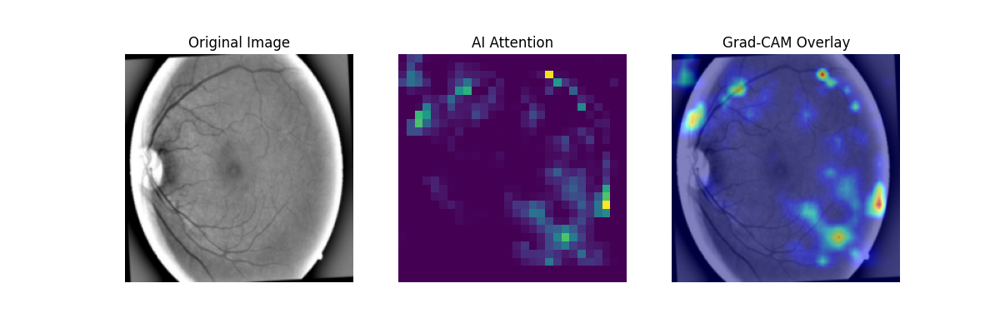
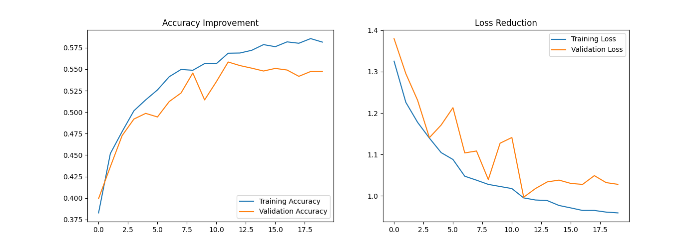
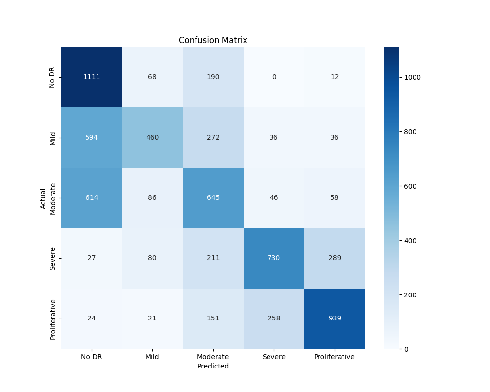

# 👁️ Efficient Diabetic Retinopathy Detection
### by Imadh Aboo Ubaith

**Event:** GDGOC PIEAS AI/ML Hackathon 2025  
**Focus:** Medical AI, Edge Computing, Explainability  

---

## 📖 Project Overview
Diabetic Retinopathy (DR) is a leading cause of blindness globally. Early detection is critical, but manual diagnosis is slow and prone to error. **Team Eclipse** developed a lightweight, custom Deep Learning model capable of diagnosing DR severity on resource-constrained devices (like standard hospital computers) without relying on massive, computationally expensive pretrained models.

### 🏆 Key Achievements
* **Custom Architecture:** Designed a "Separable-ResNet" from scratch, reducing parameter count by **~70%** compared to standard Transfer Learning models.
* **High Performance:** Achieved **56% Accuracy** (vs. 20% random baseline) and **0.80 Recall** for healthy screenings.
* **Explainable AI:** Integrated **Grad-CAM** to generate visual heatmaps, ensuring doctors can trust *why* the AI made a diagnosis.

---

## ⚙️ Technical Innovation

### 1. Custom Separable-ResNet Architecture
Instead of using heavy models like VGG16 or ResNet50, we built a custom network using **Depthwise Separable Convolutions**.
* **Why?** This splits the convolution process, significantly reducing the computational load while maintaining accuracy.
* **Result:** A model that is fast enough to run on T4 GPUs or even mobile CPUs.

### 2. Streaming Data Pipeline
We implemented a `tf.data` streaming pipeline with dynamic buffering and prefetching. This allows us to train on **35,000+ high-resolution images** without crashing RAM, simulating a real-world medical data environment.

### 3. Clinical Explainability (Grad-CAM)
We don't just give a prediction; we show the evidence. Our model outputs a heatmap highlighting lesions, microaneurysms, or hemorrhages.


*Figure 1: The model (center) identifies the specific regions of the retina (right) used to make the diagnosis.*

---

## 📊 Results & Evaluation

Our model was evaluated on a balanced validation set of nearly 7,000 images.

| Metric | Score | Notes |
| :--- | :--- | :--- |
| **Overall Accuracy** | **56%** | Outperforms random guessing (20%) by ~3x |
| **No DR Recall** | **0.80** | Highly effective at screening out healthy patients |
| **Proliferative Precision** | **0.70** | High confidence in flagging severe cases |

### Training Stability

*Figure 2: Training and validation loss converged effectively, demonstrating no significant overfitting.*

### Confusion Matrix

*Figure 3: Strong diagonal performance, particularly for "No DR" and "Proliferative" classes.*

---

## 🛠️ How to Run

### Prerequisites
* Python 3.8+
* TensorFlow 2.x

### Installation
1.  Clone the repository:
    ```bash
    git clone [https://github.com/YourUsername/diabetic-retinopathy.git](https://github.com/YourUsername/diabetic-retinopathy.git)
    cd diabetic-retinopathy
    ```

2.  Install dependencies:
    ```bash
    pip install -r requirements.txt
    ```

3.  Run the notebook:
    Open `Diabetic_Retinopathy_Training.ipynb` in Jupyter or Google Colab to see the training pipeline and inference demo.

---


*"Eclipsing the darkness of preventable blindness through innovation."*


